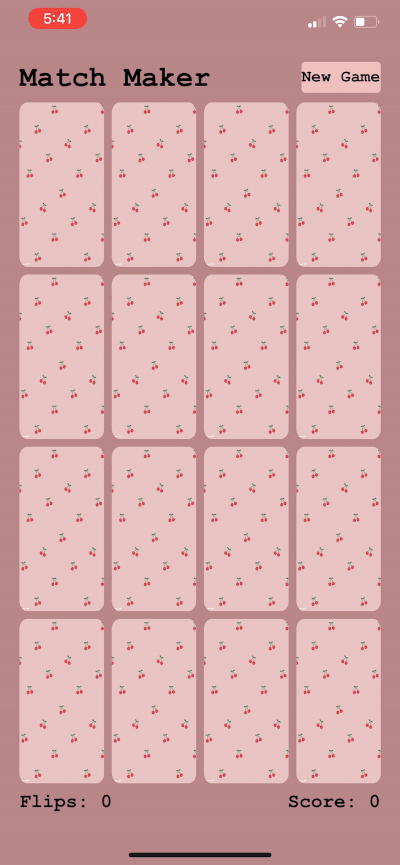

# Concentration

## Dean Stratakos
### March 31, 2020

**Concentration** is a game.

Time spent: **40** hours spent in total

## Functionality 

The following functionality is completed:

* [x] The cards have a flip animation when tapped on.
* [x] 2
* [x] 3

## Video Walkthrough

Here's a video of the game in action:

## Notes

My biggest challenge was implementing the flip animation on the cards. Given
more time, I would like to implement permanence so that the user can save their
past stats even after quitting the app.

## License

    Copyright 2020 Dean Stratakos

    Licensed under the Apache License, Version 2.0 (the "License");
    you may not use this file except in compliance with the License.
    You may obtain a copy of the License at

        http://www.apache.org/licenses/LICENSE-2.0

    Unless required by applicable law or agreed to in writing, software
    distributed under the License is distributed on an "AS IS" BASIS,
    WITHOUT WARRANTIES OR CONDITIONS OF ANY KIND, either express or implied.
    See the License for the specific language governing permissions and
    limitations under the License.
